# Toyota and Honda Sentiment Analysis
This is a project I created using data I web scraped from Edmunds.com where I performed sentiment analysis on Toyota and Honda cars' reviews.

Author: Brian Docena

# Introduction
The website I received the data from was Edmunds.com, an online resource for automative information that provides enthusiasts with reviews, pricing, and comparison tools. In order to perform analysis on the data, I web scraped the website using Selenium and BeautifulSoup. The 
main goal for this project was to give me some insight on a hypothetical. If I were to buy
a car, what should it be? I chose to focus on Toyota and Honda cars because they are my 
favorite manufacturers as their cars makes me feel nostalgic.

df_toyota_details is a dataset about each model of Toyota cars, which 
contains 39 rows and the following columns:

| Column | Description |
| ----------- | ----------- |
| 'car_model' | The model of the car |
| 'price' | The cost of the car |
| 'average_rating' | The average rating of the model |

df_toyota_reviews has the information about each review for Toyota cars, which
contains 1110 rows and the following columns:

| Column | Description |
| ----------- | ----------- |
| 'car_model' | The model of the car |
| 'reviews' | User reviews |
| 'date' | The date the review was posted |
| 'user_rating' | The rating users gave on their review |
| 'helpful numerator' | How helpful the review was |
| 'helpful_denomindator' | Total amount interacted with review |

Similarly, df_honda_details is another subset of the data containing 20 rows and the following columns:

| Column | Description |
| ----------- | ----------- |
| 'car_model' | The model of the car |
| 'price' | The cost of the car |
| 'average_rating' | The average rating owners gave to the car |

df_honda_reviews has the information about each review for Honda cars containing 675 rows and
the following columns:

| Column | Description |
| ----------- | ----------- |
| 'car_model' | The model of the car |
| 'price' | The cost of the car |
| 'owner_rating' | The overall rating owners gave to the car |
| 'reviews' | User reviews |
| 'date' | The date the review was posted |
| 'user_rating' | The rating users gave on their review |
| 'helpful numerator' | How helpful the review was |
| 'helpful_denomindator' | Total amount interacted with review |

Given these datasets, I knew I wanted to merge them based on their corresponding car model, so
that I would eventually have two dataframes: one with Toyota cars and the other with Honda cars.
There was also some data cleaning to handle as some reviews were null and duplicated because 
if a car was the same model, but a different year, the reviews would be the same.

# Data Cleaning and Exploration
For data cleaning, I did the following steps:
1. I dropped the duplicated and null reviews from df_toyota_details and df_honda_details.
    - I wanted to perform sentiment analysis on the reviews, so having duplicated reviews
    or reviews that were null had no value for me. This led me to drop these rows.

2. I merged df_toyota_details and df_toyota_reviews on the car_model to create the df_toyota dataframe.

3. I merged df_honda_details and df_honda_reviews on the car_model to create the df_honda dataframe.

4. I concated the df_honda and df_toyota dataframe into one dataframe called df_cars to make 
it easier to clean the other columns.

5. I created a function to clean the price column from a string to a float.
    - Before the cleaning the data was in a format where the price included $ and ,. Having
    the data in this format is not useful because price represents a numeric value, not a string.

6.  I created a function to clean the average_rating column.
    - Similarly, the average_rating column was formatted as a string, so I thought it was best
    convert it into a numeric column.

7. I transformed the data column into DateTime, so that the column is more useful if I choose
to use it.

The final result is a dataframe with 1323 rows and 8 columns.
(Note: the following visualization is a portion of the columns)
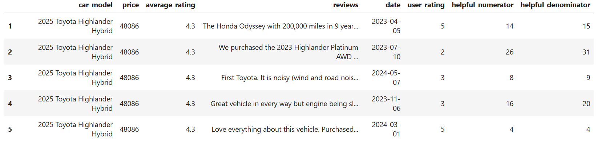

# Sentiment Analysis
For my project I used NLTK Vader to break down user reviews into positive, negative, and neutral values. Compound is a value on a scale from -1 (negative) to 1 (positive) that NLTK Vader assigns to a user's review. This value essentially determines whether a review is positive or negative. I also added a length of a review column as I thought it would be helpful to see the relationship between sentiment and review length or rating of a car model and the length of the review.

Here is a dataframe that demonstrates the statistics for each model within the dataset 
and their corresponding user's rating and their sentiment.

| car_model                           |   ('user_rating', 'mean') |   ('user_rating', 'max') |   ('user_rating', 'min') |   ('user_rating', 'std') |   ('user_rating', 'count') |   ('compound', 'mean') |   ('compound', 'max') |   ('compound', 'min') |
|:------------------------------------|--------------------------:|-------------------------:|-------------------------:|-------------------------:|---------------------------:|-----------------------:|----------------------:|----------------------:|
| 2025 Toyota GR Corolla              |                   4.875   |                        5 |                        4 |                 0.353553 |                          8 |               0.718562 |                0.9967 |               -0.2068 |
| 2024 Toyota Prius Prime             |                   4.83333 |                        5 |                        4 |                 0.389249 |                         12 |               0.517767 |                0.9992 |               -0.225  |
| 2025 Toyota Land Cruiser            |                   4.78571 |                        5 |                        3 |                 0.578934 |                         14 |               0.755557 |                0.9969 |                0      |
| 2024 Toyota Grand Highlander Hybrid |                   4.76471 |                        5 |                        3 |                 0.562296 |                         17 |               0.785335 |                0.9987 |                0.1027 |
| 2024 Toyota 4Runner                 |                   4.73469 |                        5 |                        1 |                 0.784631 |                         49 |               0.612676 |                0.9927 |               -0.9839 |

# TF-IDF
To go further in depth I wanted to run TF-IDF on user reviews. TF-IDF or Text Frequency Inverse Document Frequency is used to identify the most important words in a document across documents. By implementing this method, I thought it would give more insight on car models and what words
from reviews would best represent the car model.

After performing TF-IDF, this is what the first few rows looks like:
| car_model                     | most_important_word   |
|:------------------------------|:----------------------|
| 2025 Toyota Highlander Hybrid | choose                |
| 2025 Toyota Highlander Hybrid | ok                    |
| 2025 Toyota Highlander Hybrid | map                   |
| 2025 Toyota Highlander Hybrid | sluggish              |
| 2025 Toyota Highlander Hybrid | mpgs                  |

It looks messy having multiple rows of repeated car model and having a single word that best represents each review, so I created a function to combine all the most important words into a single list for each model.

Here is a few of the rows of the resulting dataframe:
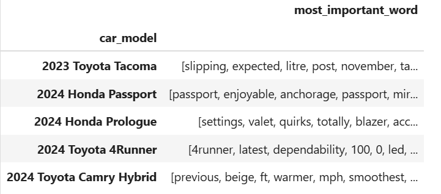

# Exploratory Data Analysis

## Testing Sentiment Analysis
To test if my sentiment analysis was working as expected, I created this visualization:
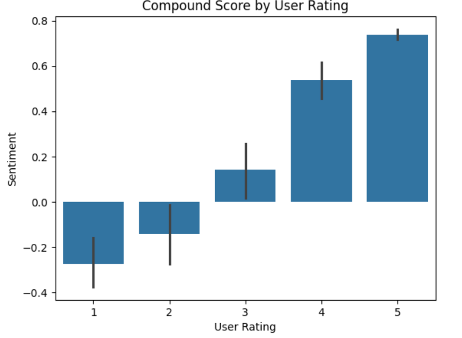
In this visualization, we can see that sentiment analysis is working as expected. The ratings associated with being negative (1-2) have the lowest compound rating with ratings of 1 having the lowest and positive ratings (4-5) have the highest.

## Relationship Between Review Length and Customer Sentiment

Here are some statistics about user review lengths:

|       |   review_length |
|:------|----------------:|
| count |        1323     |
| mean  |         564.655 |
| std   |         627.393 |
| min   |           4     |
| 25%   |         141     |
| 50%   |         339     |
| 75%   |         740.5   |
| max   |        3731     |

Here we can see that the average length of a review is around 565 characters long where the shortest review is 4 characters long and the highest is 3731 characters.

Here are some statistics about the sentiment of the reviews:

|       |    compound |
|:------|------------:|
| count | 1323        |
| mean  |    0.498047 |
| std   |    0.590111 |
| min   |   -0.9923   |
| 25%   |    0.2006   |
| 50%   |    0.7814   |
| 75%   |    0.93605  |
| max   |    0.9992   |

Here we can see that the average review has a positive sentiment (~0.5) and that most reviews
are generally positive.

While I was doing this project, I was curious on the relationship between the length of a review and rating. This led me to create the following visualization:
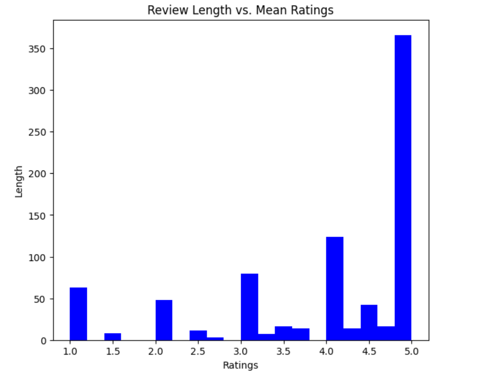

From this visualization we can see that there is a relationship between review length and average rating where individuals who rate the vehicle higher writer tend to write longer reviews on average.

Knowing that higher ratings tend to be longer in length, I was curious on the opposite. I wanted to see a review that was longer in length, but also negative.
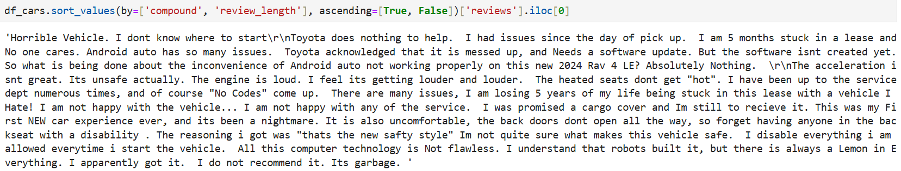

## Does Price Have An Affect on Customer Sentiment?
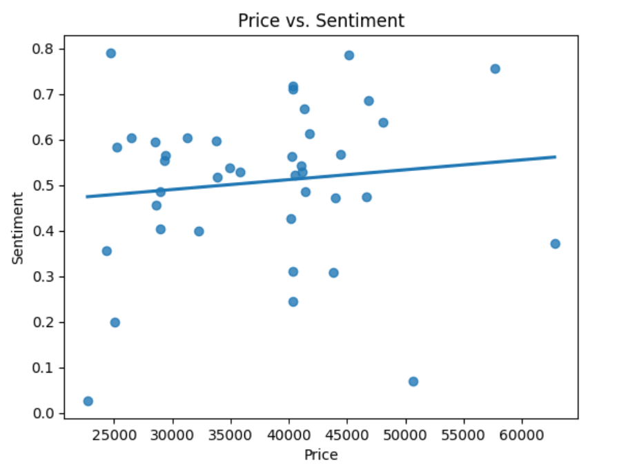
We can see in this visualization that there is some positive correlation between customers rating and the price of the car.

## Checking Sentiment Changes of Cars
For this section, I wanted to see how the sentiment of certain cars and the ratings users have given them has changed over time.

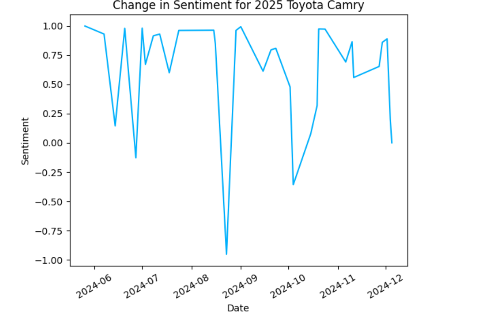

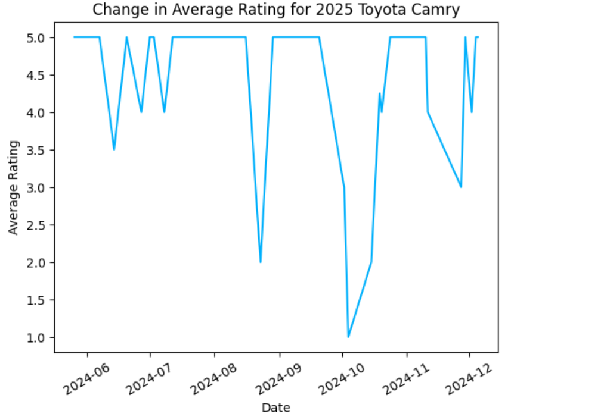
From this we can see that the Camry has some periods where users thought of the car negatively and the rating for the car has reflected that. However, people generally think of the Camry in a positive light and rate it highly.

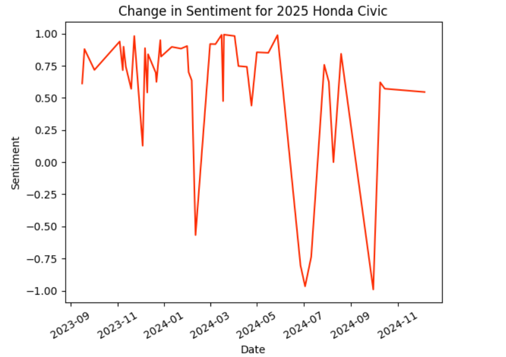
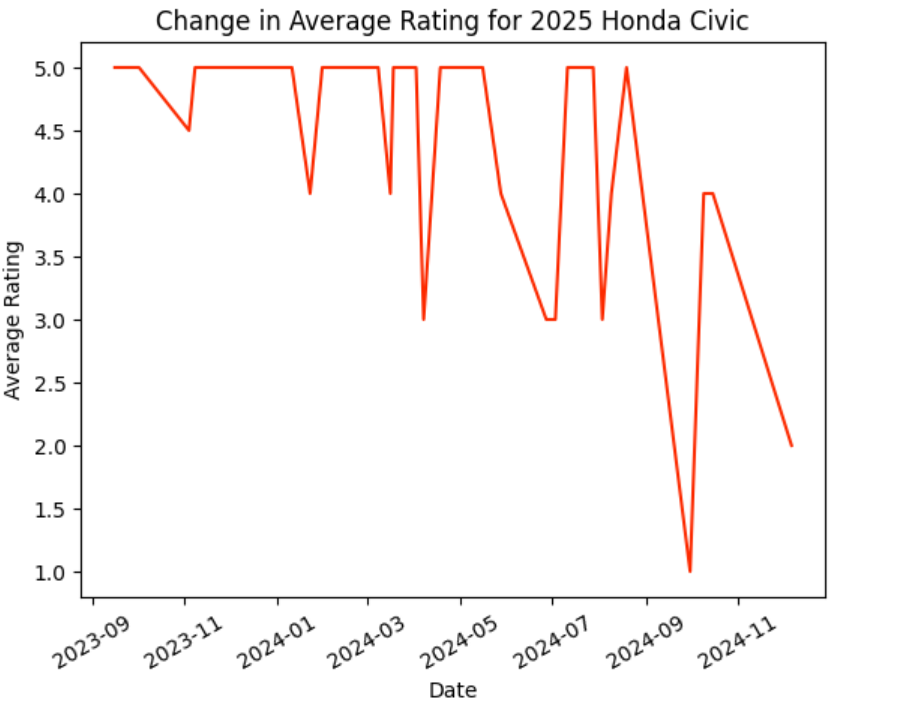

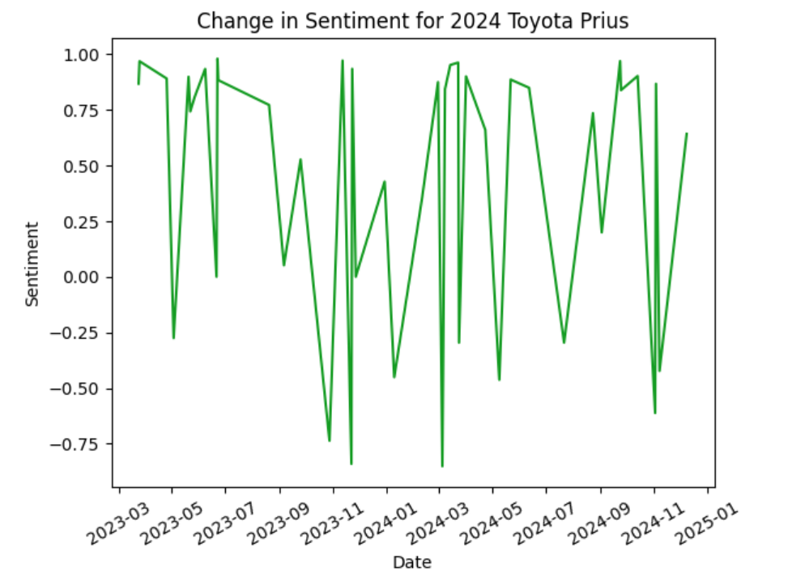
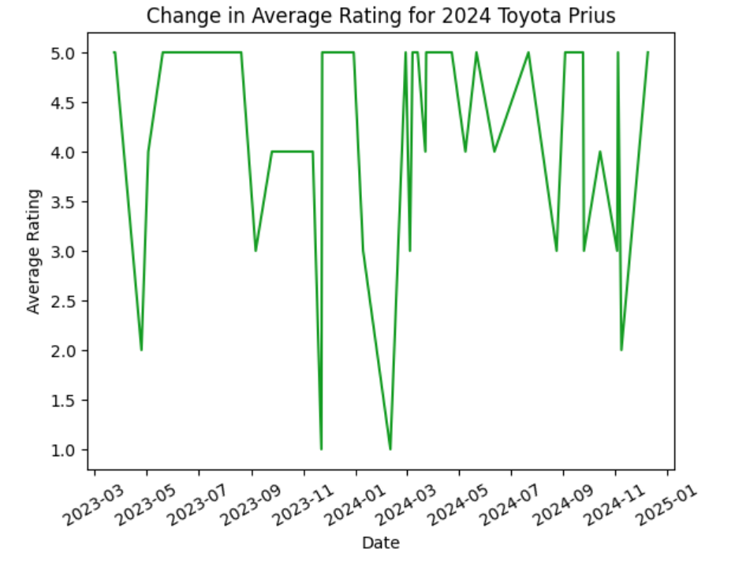

Alternatively, from the sporadic nature of the visualizations, we can see that the opinions of the Civic and Prius are divided.

# Summary of Each Car
To end my sentiment analysis project, I created a word cloud for Toyota and Honda that contains the words that were commonly found in their customer reviews.
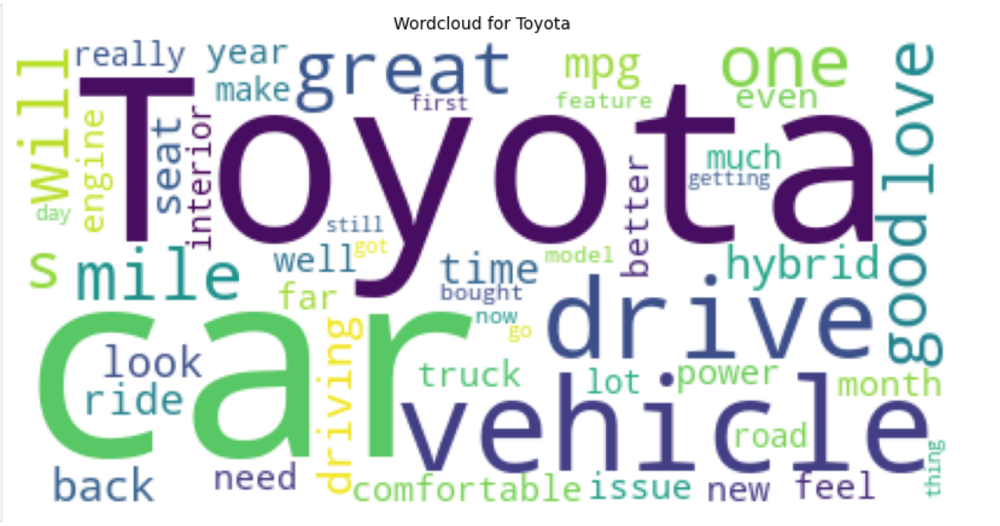

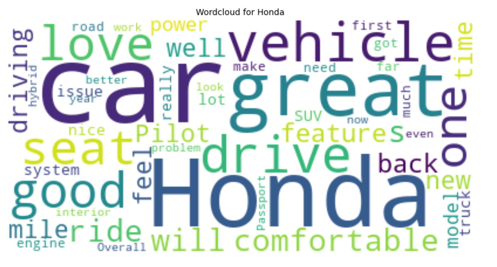